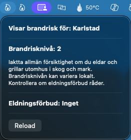

# Fire risk Mac

This is an Menu Bar Extra App MacOs that shows fire risk and fire ban for your location in Sweden. This extension won't do
anything for you if your location is set elsewhere.  

At the moment there's no way to set the location, it shows the risk for your devices location.

TODO: The icon switches color from green -> yellow -> orange -> red depending on the risk level. 
The status is updated every 5 minutes.  

## Installation
TODO  

## Credits
It uses the following API:s  
- https://api.msb.se/brandrisk/v2/swagger/index.html for fire risk information

### Icon

